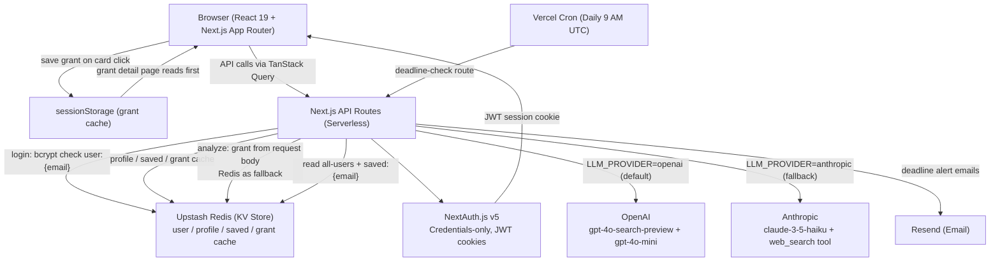

<h1 align="center">
    ✨ Welcome to Nexar-AI ✨
</h1>

<div align="center">

     

</div>

<p align="center">
  <em>Add your screenshot here: place a <code>docs/nexar-screenshot.png</code> in the repo and update this src, or use a raw GitHub URL.</em>
</p>

<p align="center">
  <a href="#-about-nexar-ai">About</a> •
  <a href="#-key-features">Features</a> •
  <a href="#%EF%B8%8F-tech-stack">Tech Stack</a> •
  <a href="#-architecture">Architecture</a> •
  <a href="#-getting-started">Getting Started</a> •
  <a href="#-usage">Usage</a> •
  <a href="#-contributing">Contributing</a> •
  <a href="#-license">License</a> •
  <a href="#-acknowledgements">Acknowledgements</a>
</p>

---

## 🚀 About Nexar-AI

Find federal grants in 5 minutes, not 5 hours. 🚀

Nexar-AI is an open-source, AI-powered federal grant discovery platform for nonprofits and small businesses. Instead of spending hours manually searching government portals, users describe their organization and goals — and the AI finds real, currently-open federal grant opportunities in seconds, with plain-English summaries and personalized eligibility scoring.

## 🌟 Key Features

- **AI Grant Discovery**: Real-time federal grant search using OpenAI (`gpt-4o-search-preview`) and Anthropic (`claude-3-5-haiku`) LLMs with built-in web search — no third-party search providers needed.
- **Personalized Recommendations**: Get grant suggestions tailored to your organization's profile, focus areas, and keywords via your dashboard.
- **Plain-English Summaries**: Two-stage AI analysis translates complex grant requirements into clear, actionable language with confidence scoring.
- **Smart Search**: Natural language search with category filters across federal grant opportunities.
- **Save & Track Grants**: Bookmark grants and manage your list — stored in Upstash Redis per user account.
- **Deadline Email Alerts**: Daily cron job sends Resend email notifications when saved grants are due in 7 days or 1 day.

## 🛠️ Tech Stack

<p align="center">
  
  
  
  
  
  
  
  
  
  
  
  
  
  
  
</p>

### Detailed Breakdown:

<details>
<summary><b>Frontend</b></summary>

- **Next.js 15** (Turbopack): App Router, server-side rendering, and serverless API routes
- **React 19**: Dynamic and responsive user interface
- **TypeScript**: Type-safe development across the entire codebase
- **Tailwind CSS v4**: Rapid and customizable styling with dark mode support
- **shadcn/ui** (Radix UI Slot + CVA): Accessible, composable UI component primitives
- **next-themes**: Light/dark theme switching; defaults to dark mode (system preference detection is disabled)
- **lucide-react**: Consistent icon set
- **class-variance-authority**, **clsx**, **tailwind-merge**: Styling utilities
</details>

<details>
<summary><b>State Management & Data Fetching</b></summary>

- **Zustand v5**: Client-side state for auth store and profile cache
- **TanStack React Query v5**: Server state, data fetching, background refetching (60s stale time)
- **SessionSync component**: Bridges NextAuth.js sessions into Zustand store automatically
</details>

<details>
<summary><b>Authentication & Storage</b></summary>

- **NextAuth.js v5** (beta): JWT session strategy with credentials provider
- **Upstash Redis**: Serverless Redis for all persistent data
  - `user:{email}` — hashed credentials
  - `profile:{email}` — organization profile
  - `saved:{email}` — saved grant IDs (set)
  - `grant:{id}` — cached grant data (24-hour TTL)
  - `all-users` — set of all registered emails (for cron)
- **bcryptjs**: Password hashing for registration
</details>

<details>
<summary><b>AI / LLM</b></summary>

- **OpenAI**: `gpt-4o-search-preview` with native web search for real-time grant discovery
- **OpenAI**: `gpt-4o-mini` for fast plain-English grant summaries
- **Anthropic**: `claude-3-5-haiku-latest` with `web_search_20250305` tool as fallback provider
- **Dual-provider support**: Set `LLM_PROVIDER=openai` or `LLM_PROVIDER=anthropic`; automatic fallback if one provider fails
- **Two-stage grant analysis**: (1) Plain-English summary → (2) Eligibility scoring with confidence percentage, reasons, and missing information
</details>

<details>
<summary><b>Email & Cron</b></summary>

- **Resend**: Transactional email for grant deadline alert notifications (free tier: 100 emails/day)
- **Vercel Cron**: Daily job at `0 9 * * *` (9 AM UTC) — scans all users' saved grants, sends alerts for grants due in 7 days or 1 day
</details>

<details>
<summary><b>Testing</b></summary>

- **Vitest**: Fast unit and integration test runner
- **@testing-library/react**: Component testing utilities
- **jsdom**: DOM simulation for tests
</details>

<details>
<summary><b>Hosting & DevOps</b></summary>

- **Vercel**: Serverless deployment; AI routes have `maxDuration: 60` for LLM latency
- **`vercel.json`**: Located at the **repo root** (not inside `app/`) — configures function timeouts and the daily cron job
- **Git**: Source code management with feature branch workflow
- **GitHub**: Collaborative development, Issues, and Pull Requests (MLH Fellowship workflow)
</details>

---

## 🏗️ Architecture



---

## 📁 Project Structure

```
Nexar-AI/
├── app/
│   ├── app/
│   │   ├── api/
│   │   │   ├── auth/           # NextAuth handler + register + account delete
│   │   │   ├── cron/           # deadline-check (daily email alerts)
│   │   │   └── v1/
│   │   │       ├── grants/     # search, recommended, [id], [id]/analyze
│   │   │       ├── profile/    # GET + PUT organization profile
│   │   │       └── saved/      # GET + POST + DELETE saved grants
│   │   ├── dashboard/          # Authenticated home with recommendations
│   │   ├── grants/[id]/        # Grant detail with AI summary + eligibility
│   │   ├── login/              # NextAuth sign-in
│   │   ├── onboarding/         # Post-registration onboarding flow
│   │   ├── profile/            # Organization profile editor
│   │   ├── register/           # New user registration
│   │   ├── saved/              # Bookmarked grants
│   │   ├── search/             # Natural language grant search
│   │   └── providers.tsx       # SessionProvider + QueryClient + ThemeProvider
│   ├── components/
│   │   ├── ui/                 # shadcn/ui primitives (Button, Card, Badge, Input)
│   │   ├── Navbar.tsx
│   │   ├── ThemeToggle.tsx
│   │   ├── OnboardingTour.tsx
│   │   └── landing/
│   │       └── GrantVisualization.tsx
│   ├── lib/                    # Shared utilities (auth, kv, grant-cache, stores)
│   ├── scripts/
│   │   └── seed-demo-user.ts   # Seeds demo account into Redis
│   ├── types/                  # TypeScript augmentations
│   ├── .env.example            # Environment variable template
│   └── package.json
├── tests/                      # Vitest test files
├── vercel.json                 # Vercel config (maxDuration, cron schedule)
├── CONTRIBUTING.md
└── README.md
```

---

## 🚀 Getting Started

These instructions will help you set up Nexar-AI on your local machine for development and testing.

### Prerequisites

- **Node.js** v18 or later
- **npm** (comes with Node.js)
- **OpenAI API key** or **Anthropic API key** (at least one required for grant discovery)
- **Upstash Redis** database — free tier works (create at [upstash.com](https://upstash.com) or via [Vercel Integrations → Upstash](https://vercel.com/integrations/upstash))

### Installation

1. **Fork and clone the repository:**
   ```bash
   git clone https://github.com/sakshit2004/Nexar-AI.git
   cd Nexar-AI/app
   ```

2. **Install dependencies:**
   ```bash
   npm install
   ```

3. **Copy the environment variable template:**
   ```bash
   cp .env.example .env.local
   ```

4. **Fill in your API keys** in `app/.env.local` — at minimum:
   ```env
   # Required — generate with: openssl rand -base64 32
   NEXTAUTH_SECRET=your-secret-here
   NEXTAUTH_URL=http://localhost:3000

   # At least one LLM provider is required
   OPENAI_API_KEY=your-openai-key
   # ANTHROPIC_API_KEY=your-anthropic-key
   LLM_PROVIDER=openai

   # Required for persistent storage (free tier at upstash.com)
   UPSTASH_REDIS_REST_URL=your-upstash-url
   UPSTASH_REDIS_REST_TOKEN=your-upstash-token
   ```

5. **(Optional) Seed the demo user into Redis:**
   ```bash
   npx tsx scripts/seed-demo-user.ts
   ```
   > This creates a demo account (`admin@mlh.com`) in Redis for quick testing. Requires Redis env vars to be set. Skip if you plan to register your own account.

6. **Start the development server:**
   ```bash
   npm run dev
   ```

7. **Open your browser** and go to `http://localhost:3000`.

### Running Without Redis

**Login and registration both require Redis.** The authentication system (`lib/auth.ts`) calls `user:{email}` on every sign-in attempt and returns `null` (fails closed) if Redis is unavailable — there are no hardcoded fallback credentials. Without Redis, you will not be able to log in or create an account.

The public landing page (`/`) and the unauthenticated grant search API (`GET /api/v1/grants/search`) work without Redis, but every authenticated feature — dashboard, saved grants, profile, and grant detail — requires a valid session, which requires Redis.

**To run the full app locally, Upstash Redis is required.** The free tier at [upstash.com](https://upstash.com) is sufficient.

---

## 🔐 Environment Variables

| Variable | Required | Description |
|---|---|---|
| `NEXTAUTH_SECRET` | Yes | JWT signing secret — generate with `openssl rand -base64 32` |
| `NEXTAUTH_URL` | Yes | App URL (`http://localhost:3000` locally) |
| `OPENAI_API_KEY` | One of these | OpenAI API key for `gpt-4o-search-preview` and `gpt-4o-mini` |
| `ANTHROPIC_API_KEY` | One of these | Anthropic API key for `claude-3-5-haiku-latest` |
| `LLM_PROVIDER` | Yes | `openai` (default) or `anthropic` |
| `UPSTASH_REDIS_REST_URL` | Recommended | Upstash Redis REST URL |
| `UPSTASH_REDIS_REST_TOKEN` | Recommended | Upstash Redis REST token |
| `RESEND_API_KEY` | Optional | Resend API key for deadline alert emails |
| `CRON_SECRET` | Optional | Bearer token for Vercel cron job security |

See [`app/.env.example`](app/.env.example) for the full reference with comments.

---

## 📖 Usage

Once the project is running:

1. **Sign in** — Register a new account or use an existing one.
2. **Complete onboarding** — First-time users are guided through a 7-step onboarding wizard (`/onboarding`) covering your name, organization details, focus areas, location, and grant preferences. Returning users can edit these at any time from the Profile page.
3. **Discover grants** — Use the Dashboard for AI-powered personalized recommendations (built from your focus areas, org type, and keywords), or the Search page for keyword and category-filtered grant search.
4. **View grant details** — Click any grant to see the full description, eligibility requirements, deadline, and AI-generated plain-English summary with eligibility confidence score.
5. **Save & track** — Bookmark grants you're interested in. With Resend configured, you'll receive email alerts when saved grants are due in 7 days or 1 day.

---

## 🤝 Contributing

We welcome contributions from the community and MLH Fellows! Please read [CONTRIBUTING.md](CONTRIBUTING.md) for the full guide.

### Quick Contribution Workflow

1. **Fork** the repository and create a feature branch:
   ```bash
   git checkout -b feature/your-feature-name
   ```
2. **Make your changes** — ensure `npm run build` passes with zero errors.
3. **Run tests:**
   ```bash
   npm test
   ```
4. **Open a Pull Request** against `main` with a clear description of what you changed and why.

**Branch naming conventions:**
- `feature/` — new features
- `fix/` — bug fixes
- `docs/` — documentation updates
- `refactor/` — code refactoring

Please keep PRs focused — one feature or bug fix per PR. For major changes, open an Issue first to discuss the approach.

---

## 📄 License

This project is licensed under the MIT License — see the [LICENSE](LICENSE) file for details.

---

## 🙏 Acknowledgements

- **[OpenAI](https://openai.com)** — for `gpt-4o-search-preview` and `gpt-4o-mini` with native web search capabilities
- **[Anthropic](https://anthropic.com)** — for Claude 3.5 Haiku with the `web_search_20250305` tool
- **[Vercel](https://vercel.com)** — for the modern Next.js deployment and hosting experience
- **[Upstash](https://upstash.com)** — for serverless Redis with a generous free tier
- **[Resend](https://resend.com)** — for transactional email with a developer-friendly API
- All open-source libraries and tools that made this project possible
- **[MLH Fellowship](https://fellowship.mlh.io/)** — for creating a program that gives developers real-world, open-source experience

---

<div align="center">

[](https://github.com/sakshit2004)

**[⭐ Star this repo](https://github.com/sakshit2004/Nexar-AI) · [🐛 Report a Bug](https://github.com/sakshit2004/Nexar-AI/issues/new?template=bug_report.md) · [💡 Request a Feature](https://github.com/sakshit2004/Nexar-AI/issues/new?template=feature_request.md) · [🎓 MLH Fellowship](https://fellowship.mlh.io/)**

</div>
